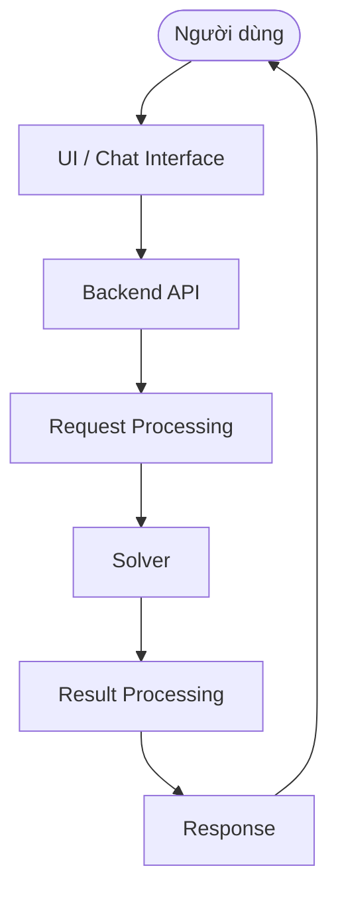

# Luồng hoạt động của Hệ thống LP_Chatbot

Tài liệu này mô tả chi tiết cách hệ thống LP_Chatbot hoạt động, từ lúc người dùng nhập tin nhắn bằng ngôn ngữ tự nhiên cho đến khi nhận được kết quả giải hệ phương trình Quy hoạch tuyến tính (Linear Programming).

---

## 1. Mô tả tổng quan

LP_Chatbot sử dụng một luồng **"Pipeline"** khép kín được điều phối tập trung bởi `DialogManager`. 

Khi người dùng gửi một bài toán, hệ thống không gọi AI để giải toán trực tiếp (do AI Language Model dễ tính toán lượng giác và đại số sai). Thay vào đó, AI chỉ được sử dụng để **"Hiểu"** (Extract & Parse) đề bài tự nhiên thành một cấu trúc dữ liệu JSON chặt chẽ. Cấu trúc này sau đó được chuyển cho một hệ thống **"Máy tính toán"** (LP Solver Engine) chuyên dụng bằng Python để giải chính xác tuyệt đối từng bước. 

Cuối cùng, các Log toán học (bảng Tableau / Dictionary) được trả về kết hợp với một lần gọi AI phụ trợ để diễn giải ngữ nghĩa cho người dùng dễ hiểu.

---

## 2. Các bước xử lý chính

Luồng xử lý từ đầu đến cuối diễn ra theo thứ tự sau:

1. **User Input:** Người dùng nhập tin nhắn/đề bài trên giao diện Web (ví dụ: *"Giải bài toán max Z = x1 + x2, với x1 <= 5 ..."*).
2. **FastAPI Endpoint:** Client Frontend gọi API xuống hệ thống thông qua giao thức truyền phát Server-Sent Events (SSE) tại endpoint `/chat/stream`.
3. **Dialog Manager:** Tiếp nhận request, trích xuất đoạn hội thoại đang diễn ra (Session/Context) từ bộ nhớ hệ thống.
4. **NLP Processing (Extraction):** Khởi tạo Prompt (kèm bài toán) lên OpenAI API để bóc tách thông tin hàm mục tiêu, các hệ số, các ràng buộc và định dạng ép kiểu thành JSON Schema tiêu chuẩn.
5. **LP Problem Validation:** Kiểm tra tính hợp lệ của JSON trả về.
6. **LP Solver (Thuật toán lõi):** 
   - Chuẩn hóa bài toán (Standardize) về dạng cơ sở chung.
   - Dispatch tới thuật toán giải (Simplex Dictionary, Bland, Geometric, PuLP).
   - LP Solver thực thi giải và sinh ra nghiệm tối ưu. Đồng thời log lại lộ trình từng bước giải dưới dạng toán học LaTeX System of Equations (`\begin{aligned}`).
7. **Response Streaming & Explanation:** 
   - `DialogManager` ngay lập tức ném chuỗi Markdown Toán học (step-by-step LaTeX) trực tiếp về Frontend cho người dùng xem ngay.
   - Sau đó `DialogManager` gửi nghiệm JSON lên OpenAI API một lần nữa yêu cầu AI đóng vai gia sư Toán học tóm tắt, giải thích dễ hiểu tiến trình vừa giải.
8. **UI Rendering:** Frontend nhận dữ liệu stream tuần tự và được render bằng KaTeX/MathJax ra giao diện HTML đẹp mắt.

---

## 3. Sơ đồ Kiến trúc Hệ thống (Architecture Flow)

Dưới đây là biểu đồ mô tả luồng chu chuyển dữ liệu giữa các thành phần.

---

## 4. Giải thích chi tiết từng thành phần

### 4.1. FastAPI Backend (`main.py` & `app/api/`)
Đây là lớp vỏ ngoài cùng, khởi chạy server HTTP thông qua Uvicorn. Nó xử lý các tính năng Middleware hệ thống cốt yếu như: Quản lý CORS, phục vụ Static Assets (HTML/CSS/JS) gắn vào template, định tuyến API (Routing). Nó mở cổng Web Socket hoặc HTTP Streaming Request tiếp ứng từ Browser.

### 4.2. Dialog Manager (`app/chatbot/dialog_manager.py`)
Là "Nhạc trưởng" của hệ thống phần mềm. 
Nhiệm vụ chính yếu là duy trì `Session Timeout` và `Memory Context` của User. Nếu người dùng nhập câu không liên quan hoặc dữ liệu bị thiếu khuyết, nó quản lý việc hỏi lại. Nếu người dùng đột ngột ra lệnh "từ giờ hãy giải bằng biểu đồ geometric", Dialog Manager sẽ điều phối cờ cấu hình lưu trữ của Session. Đồng thời nó điều tiết tốc độ Server-Sent Event `stream chunks` về Client.

### 4.3. NLP Processing (`app/nlp/`)
Phần đóng vai trò AI sử dụng `AsyncOpenAI` client (hoặc prompt template layer custom). Bao gồm 2 pipeline chính:
- **Parser Intelligence:** Ép Agent (prompt engineering) đọc hiểu ngoại lệ text người dùng nhập và cấu trúc ra JSON Schema được định nghĩa khắt khe (VD: loại bỏ các ẩn biến vô giá trị). Đảm bảo LP Solver phía sau đọc được và không bị văng Exception syntax.
- **Explainer Intelligence:** Yêu cầu LLM đóng vai một học giả Toán để nhận xét vì sao bài toán ra kết luận "Vô nghiệm" (Infeasible), hoặc "Vô hạn" (Unbounded) thông qua Log thuần túy do hệ thống Python trả ra.

### 4.4. LP Solver (`app/solver/`)
Là các module Python thuần túy kỹ thuật (Toán – Giải tích), hoàn toàn **không** chứa trí tuệ nhân tạo (AI-free zone):
- `dispatcher.py`: Bộ Router của Thuật toán. Dựa vào Session Context Configuration để móc nối module `geometric.py`, thư viện `PuLP` hoặc engine `simplex`.
- `algorithms/base_simplex_dictionary_solver.py`: Node Core thực thi giải thuật toán Đơn hình (Simplex) theo format Hệ Phương Trình (Dictionary/System of Equations). Ở đây có hệ thống Rule Pivot (như Dantzig, Bland) chống xoay vòng (cycle) và sinh mã LaTeX Matrix Tableaus.
- `app/solver/utils.py`: Chứa method _standardize_problem_. Tự động biến đổi các biểu thức toán học tự nhiên lộn xộn (trộn lẫn `>=`, `<=`, `=`, `MAX`, `MIN` RHS âm/dương) về một Format Cơ Sở chung (Standard Form: Minimize và tịnh tiến Constant RHS dương) trước khi nạp ma trận vào Simplex Engine.
