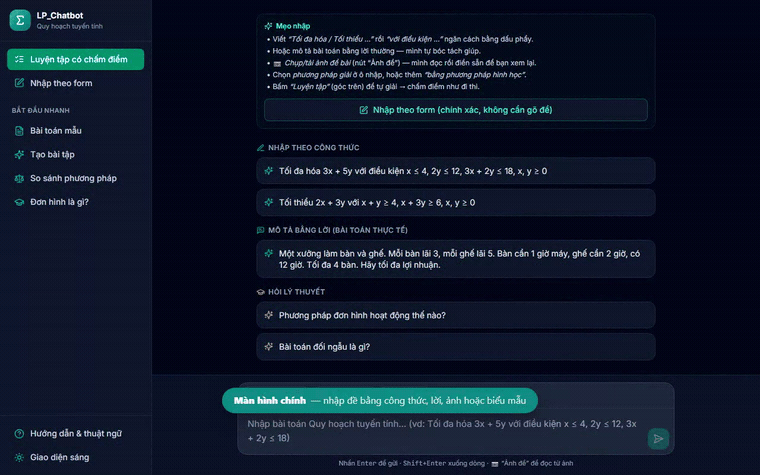
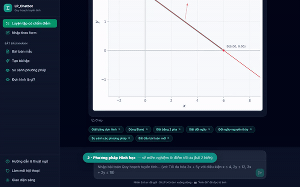
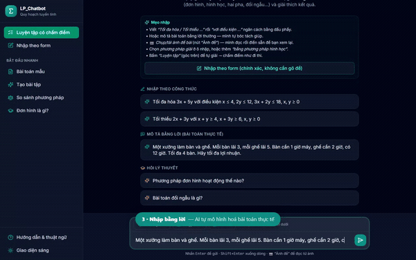
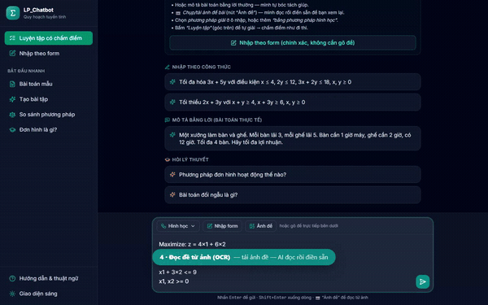
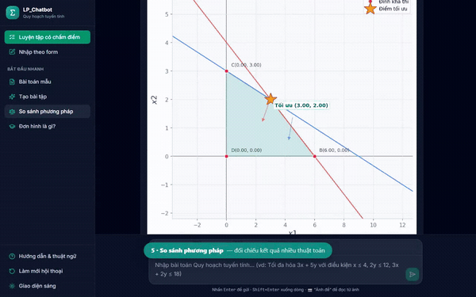

<div align="center">

# 🧮 LP_Chatbot

### Trợ lý AI giải **Quy hoạch tuyến tính** — mô hình hoá & giải từng bước

Nhập đề bằng **công thức · lời nói · ảnh chụp · biểu mẫu** → giải bằng **7 phương pháp** →
trình bày **lời giải từng bước** đúng chuẩn bài giảng.
Phần toán do **bộ giải thật** đảm nhiệm (**0 sai lệch** so với PuLP), AI chỉ lo hiểu ngôn ngữ.

<br/>


<br/>



▶️ **[Xem video demo đầy đủ (MP4, ~2 phút)](demo/assets/lp_chatbot_demo.mp4)**

</div>

---

## ✨ Tính năng nổi bật

<table>
  <tr>
    <td width="50%" valign="top">
      <b>📐 Phương pháp hình học</b><br/>
      <sub>Vẽ miền nghiệm &amp; điểm tối ưu (bài 2 biến).</sub><br/>
      
    </td>
    <td width="50%" valign="top">
      <b>💬 Nhập bằng lời (NLP)</b><br/>
      <sub>AI tự mô hình hoá bài toán thực tế.</sub><br/>
      
    </td>
  </tr>
  <tr>
    <td width="50%" valign="top">
      <b>📷 Đọc đề từ ảnh (OCR)</b><br/>
      <sub>Tải ảnh đề — AI đọc nội dung rồi giải.</sub><br/>
      
    </td>
    <td width="50%" valign="top">
      <b>🎓 Luyện tập có chấm điểm</b><br/>
      <sub>Tự sinh đề, tự giải, theo dõi tiến độ.</sub><br/>
      
    </td>
  </tr>
</table>

---

## 🎯 Giới thiệu

**LP_Chatbot** giúp người học giải các bài toán **Quy hoạch tuyến tính (Linear Programming)** mà
không vướng hai rào cản quen thuộc: **mô hình hoá** đề thực tế và **thao tác tính toán** của
phương pháp đơn hình.

Điểm khác biệt là thiết kế **lai (hybrid)**: mô hình ngôn ngữ lớn (LLM) chỉ đảm nhiệm khâu
*hiểu ngôn ngữ* (đọc đề, đọc ảnh, diễn giải), còn **toàn bộ phần toán do các bộ giải thật**
(NumPy/PuLP) thực hiện — nhờ đó kết quả luôn chính xác và lời giải từng bước đúng chuẩn lớp học,
thay vì để LLM "tự tính" và dễ sai.

| | | |
|---|---|---|
| **7** phương pháp giải | **4** cách nhập đề | **0** sai lệch so với PuLP |
| **79** test `pytest` đạt | **16** họ bài toán kiểm chứng | LaTeX + đồ thị trực quan |

---

## 🧩 Các tính năng chính

- 🤖 **Hiểu ngôn ngữ tự nhiên** — tiếp nhận đề từ lời nói thông thường (Việt/Anh).
- 📐 **Mô hình hoá tự động** — trích xuất hàm mục tiêu và ràng buộc thành mô hình LP.
- ⚙️ **Giải đa thuật toán** — 7 phương pháp (xem bảng bên dưới), tự chọn hoặc do người dùng chỉ định.
- 📊 **Lời giải từng bước** — trình bày dạng từ vựng (dictionary) với hệ số phân số, mũi tên biến
  vào/ra, ô xoay và nhãn đỉnh, render bằng **KaTeX**.
- 📷 **Nhập linh hoạt** — gõ công thức, mô tả bằng lời, **chụp/tải ảnh (OCR)** hoặc **biểu mẫu**.
- 🎓 **Hỗ trợ học tập** — luyện tập có chấm điểm, tạo bài tập, so sánh phương pháp, giải thích thuật ngữ.
- ⚡ **Streaming thời gian thực** — phản hồi mượt qua Server-Sent Events (SSE).

### Các phương pháp giải

| Phương pháp | Phạm vi áp dụng |
|---|---|
| Đơn hình (từ vựng, Dantzig) | Bài chuẩn |
| Đơn hình Bland | Chống xoay vòng cho bài suy biến |
| Hai pha (biến phụ trợ) | Khi từ vựng xuất phát chưa khả thi |
| Đơn hình đối ngẫu | Hệ số mục tiêu ≥ 0 nhưng vế phải âm |
| Hai pha đối ngẫu–gốc | Kết hợp đối ngẫu (Pha 1) + đơn hình (Pha 2) |
| Hình học | Bài 2 biến — vẽ miền nghiệm, xét các đỉnh |
| PuLP CBC | Bộ giải công nghiệp, dùng làm chuẩn đối chiếu |

---

## 🛠️ Công nghệ sử dụng

| Lớp | Công nghệ |
|---|---|
| **Backend** | Python · FastAPI · NumPy · PuLP (CBC) · Matplotlib · Redis (phiên) |
| **AI / NLP** | API tương thích OpenAI (OpenRouter) — hỗ trợ **vision** cho OCR |
| **Frontend** | React · Vite · Tailwind CSS · KaTeX · marked |
| **Kiểm thử** | pytest · Playwright (chụp ảnh/quay demo tự động) |
| **DevOps** | Docker · Docker Compose |

---

## 🏗️ Kiến trúc hệ thống

Thiết kế hướng dịch vụ; Frontend (trình duyệt) ↔ Backend qua HTTP/SSE:

- **FastAPI Backend** (`main.py`) — điều phối HTTP/SSE, quản lý vòng đời ứng dụng.
- **Dialog Manager** (`app/chatbot/dialog_manager.py`) — "bộ não" điều phối hội thoại, lưu bối cảnh,
  gọi các module khác.
- **NLP** (`app/nlp/`) — bóc tách đề từ ngôn ngữ tự nhiên (parser luật + LLM), đọc đề từ ảnh, diễn giải.
- **Solver** (`app/solver/`) — cài đặt 7 thuật toán LP; nơi bảo đảm **tính đúng đắn** và sinh
  **lời giải từng bước**.

---

## 🚀 Cài đặt nhanh

> **Yêu cầu:** một khoá `OPENAI_API_KEY` hợp lệ (cho NLP/OCR). Copy `.env.example` → `.env` và điền cấu hình.

<details open>
<summary><b>Cách 1 — Docker (khuyên dùng)</b></summary>

```bash
docker-compose up -d --build      # build & chạy ngầm (web app + Redis)
docker-compose logs -f            # xem log khởi động
```
Ứng dụng chạy tại 👉 `http://localhost:8000`
</details>

<details>
<summary><b>Cách 2 — Chạy trực tiếp (Python + React)</b></summary>

```bash
# Backend (FastAPI)
python -m venv venv
# Windows:        .\venv\Scripts\activate
# macOS/Linux:    source venv/bin/activate
pip install -r requirements.txt
uvicorn main:app --host 0.0.0.0 --port 8000 --reload

# Frontend (React) — build 1 lần để FastAPI phục vụ SPA tại /app/
cd frontend
npm install
npm run build        # xuất ra ../static/app
# HOẶC dev hot-reload (cần backend ở cổng 8000): npm run dev  → http://localhost:5173
```
Truy cập `http://localhost:8000` (tự chuyển hướng tới `/app/`).
Cấu hình LLM/proxy trong [.env.example](.env.example): `OPENAI_API_KEY`/`API_KEY`,
`OPENAI_BASE_URL`/`BASE_URL`, `MODEL_NAME`.
</details>

---

## 📁 Cấu trúc thư mục

```text
LP_CHATBOT/
├── app/
│   ├── api/        # HTTP router endpoints (REST)
│   ├── chatbot/    # Dialog Manager, quản lý session
│   ├── core/       # Cấu hình (Settings), hằng số
│   ├── nlp/        # Xử lý ngôn ngữ tự nhiên, OpenAI API, prompt templates
│   └── solver/     # 7 thuật toán LP + chuẩn hoá mô hình
├── frontend/       # Giao diện React (Vite + Tailwind)
├── demo/           # Video & GIF demo + script quay tự động
├── tests/          # Bộ test pytest
├── docker-compose.yml · Dockerfile · main.py · requirements.txt · Makefile
```

---

## 🧪 Kiểm thử

```bash
pytest                                   # toàn bộ test
pytest -v                                # chi tiết từng test
pytest tests/test_solver.py -q --tb=short
```

Các bộ giải tự cài đặt được **đối chiếu với PuLP CBC** (oracle) trên 16 họ bài toán →
**0 sai lệch** về trạng thái và giá trị tối ưu.

---

<div align="center">
<sub>Đồ án môn Quy hoạch tuyến tính · Khoa Toán – Tin học · ĐH Khoa học Tự nhiên (HCMUS)</sub>
</div>
